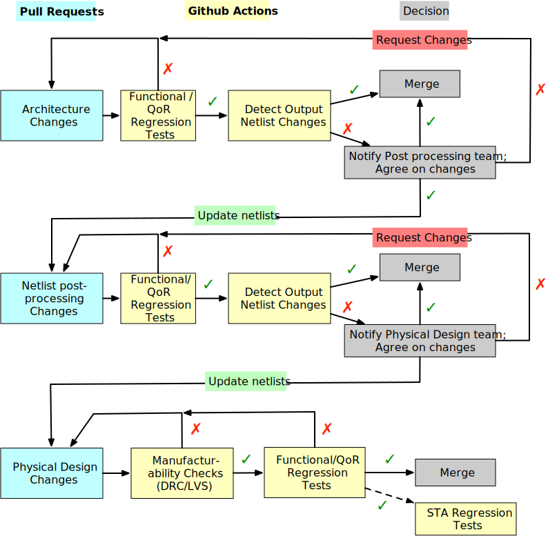
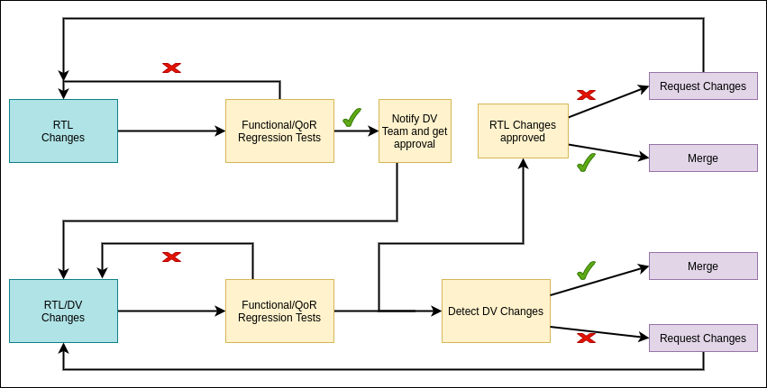

.. _developer_contributor_guidelines:

Contributor Guidelines
======================

Motivation
----------
Github projects involve many parties with different interests.
It is necessary to establish rules to

- guarantee the quality of each pull request by establishing a standard
- code review for each pull request is straightforward
- contributors have confidence when submitting changes

Create Pull requests
--------------------

- Contributors should state clearly their motivation and the principles of code changes in each pull request
- Contributors should be active in resolving conflicts with other contributors as well as maintainers. In principle, all the maintainers want every pull request in and are looking for reasons to approve it.
- Each pull request should pass all the existing tests in CI (See :ref:`developer_contributor_guidelines_checkin_system` for details). Otherwise, it should not be merged unless you get a waiver from all the maintainers.
- Contributors should not modify any codes/tests which are unrelated to the scope of their pull requests.
- The size of each pull request should be small. Large pull request takes weeks to be merged. The recommend size of pull request is up to 500 lines of codes changes. If you have one large file, this can be waived. However, the number of files to be changed should be as small as possible.

  .. note:: For large pull requests, it is strongly recommended that contributors should talk to maintainers first or create an issue on the Github. Contributors should clearly define the motivation, detailed technical plan as well as deliverables. Through discussions, the technical plan may be requested to change. Please do not start code changes blindly before the technical plan is approved.

- For any new feature/functionality to be added, there should be

  - Dedicated test cases in CI which validates its correctness
  - An update on the documentation, if it changes user interface
  - Provide sufficient code comments to ease the maintenance

.. _developer_contributor_guidelines_checkin_system:

Check-in System
---------------

The check-in system aims to offer a standardized way to 

- ensure quailty of each contribution
- resolve conflicts between teams

It is designed for efficient communication between teams.

For eFPGA IPs
^^^^^^^^^^^^^

:numref:`fig_fpga_tapeout_workflow_logic` illustrates the typical workflows for each team when merging a pull request.

.. seealso:: Before start communications to resolve any conflict, please check team responsibilities in :ref:`developer_code_owners`

.. _fig_fpga_tapeout_workflow_logic:

  eFPGA workflows (solid lines represent required checks, dash lines denote optional checks)

.. warning:: We cannot put the complete physical design flow on Github Actions. The limitations is on the long runtime due to the limited number of licenses. In such case, we need a team or set up a weekly CI to run the physical design on an isolated runner and check consistency between the generated GDS through scripts and the GDS hard copy on github

    - So the PD team may need to update post-processed netlists, physical design scripts, without any checks.
    - Only when GDS is submitted, there are checks triggered automatically

.. note:: For DRC checks, we need to ensure sufficient licenses for Calibre or any tool recommended by TSMC. If we have very limited licenses, the DRC run can be very long (1+ day). In such case, we should put a simplified deck on CI, which can error out in short time (if there is anything wrong).

.. note:: For timing sign-off, we may consider to add part of STA regression tests as a required checks before merging any physical design changes. I believe we should check setup/hold time violations before merging any GDSII, while detailed timing analysis should be optional.

For SoCs and ASICs
^^^^^^^^^^^^^^^^^^

DV flow should be implemented to approve any changes made in the RTL or TB files before checking in to the master repo. This flow will run the SoC level sanity-regression on the DV side to assure that the changes you made in the RTL or DV doesn't break compilation or simulation of the project.

:numref:`fig_soc_tapeout_workflow_logic` is an extension of :numref:`fig_fpga_tapeout_workflow_logic` and uses the same legends.
The regression run after the RTL changes is meant for the mini-regression that RTL engineers should run on IP or SoC RTL before sending the pull request. Once pull request is generated, it will trigger the SoC DV regression that will run the sanity tests for the whole SoC. Once this regression passes, RTL/DV engineers will be able to merge the changes to the master repo.

.. _fig_soc_tapeout_workflow_logic:

  SoC workflows (solid lines represent required checks, dash lines denote optional checks)

.. note:: Whenever there is a change in the RTL or DV files, this change must be approved by the DV to assure that the compilation/simulations are not broken before checking in to the main repo. A broken compilation or simulation can have severe impact on the productivity and the nightly regression tests that we will be running on the SoC in the later stage of the project.

